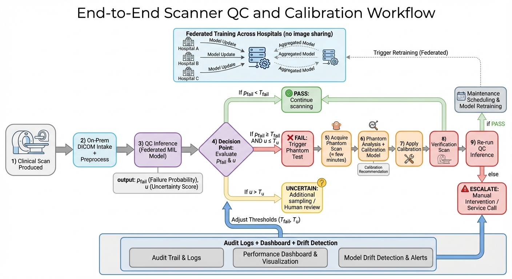

# MedicalQC

**MedicalQC** is a production-grade research codebase for federated, domain-generalized quality control (QC) of CT/MRI scanners. We propose a study-level QC pipeline that combines a shared Swin-T slice encoder, MIL attention pooling, a spectral branch, and an uncertainty head, with **private LoRA adapters per hospital** to preserve site-specific adaptations in federated training. The repository provides a full end-to-end pipeline (data → training → evaluation → inference) with Hydra configuration and MLflow tracking.

## Key contributions
- **Federated, domain-generalized QC** with a clear separation between shared backbone parameters and **private hospital-specific LoRA adapters**.
- **Multi-branch slice encoding** (Swin-T + spectral features) with configurable fusion strategies.
- **Study-level MIL aggregation** that handles variable-length slice sets with attention and worst-slice Top-K signals.
- **Uncertainty-aware decisions** with evidential, MC-dropout, or temperature scaling options.
- **Reproducible research code** with deterministic seeding, Hydra configs, MLflow tracking, and tests.

## Method overview
The pipeline ingests CT/MRI studies as bags of slices, computes slice-level embeddings, aggregates them into a study representation, and outputs a QC pass/fail decision with calibrated uncertainty. See the pipeline figure below.



## Model architecture
Each slice is encoded by a shared Swin-T backbone. A spectral branch computes FFT-based features, and a fusion module combines visual and spectral embeddings. Study-level aggregation is performed via MIL attention and worst-slice Top-K signals. The final classifier includes an uncertainty head, and **private LoRA adapters** are attached per hospital (client-only, not shared).


## Federated learning protocol
- **Server** maintains and aggregates only **shared** backbone and head parameters (FedAvg or FedAdam).
- **Clients** train on local hospital data and update:
  - shared parameters (sent to server), and
  - **private LoRA adapters** (never shared).
- **Unseen-hospital evaluation** is performed on holdout client(s) excluded from training.

## Dataset format
### Toy dataset (synthetic)
A built-in generator produces synthetic studies with simulated artifacts and domain styles for tests and quickstart.

### Folder backend (real data)
```
DATA_ROOT/
  hospital_000/
    study_000/
      meta.json
      slice_000.npy
      slice_001.npy
  hospital_001/
    ...
```
`meta.json` example:
```json
{"modality": "CT", "body_part": "head", "label": 0, "scanner_id": "scanner_01"}
```

## Training and evaluation
- **Central training** pools training hospitals into a single dataset.
- **Federated simulation** trains per-hospital clients with private LoRA adapters.
- **Unseen-hospital testing** evaluates on holdout hospitals (never used in training).

## Metrics reported
- AUROC
- AUPRC
- Sensitivity at fixed specificity
- Expected Calibration Error (ECE)

## Inference and deployment
### On-prem inference
```bash
python -m src.infer.infer_study --study /path/to/DATA_ROOT/hospital_000/study_000 --model /path/to/shared.pt
```

### FastAPI stub
```bash
uvicorn src.infer.service_stub:app --host 0.0.0.0 --port 8000
```

## Reproducibility
- Deterministic seeds via `train.seed` and `train.deterministic`.
- Resolved Hydra config and environment info logged to MLflow artifacts under `repro/`.

## Repository structure
```
conf/                    # Hydra config groups and defaults
src/
  data/                  # datasets, samplers, datamodule
  models/                # Swin-T, LoRA, spectral, MIL, uncertainty, QC model
  federated/             # client/server/aggregation/runner
  train/                 # central and federated trainers
  eval/                  # metrics and evaluator
  infer/                 # study inference and FastAPI stub
  utils/                 # config, MLflow, logging, plotting
  train_central.py        # central training entrypoint
  train_federated.py      # federated training entrypoint
reports/                 # (optional) generated reports/artifacts
figures/                 # pipeline/model figures used in README
```

## Installation
Install PyTorch (example, CUDA 12.1):
```bash
pip install --index-url https://download.pytorch.org/whl/cu121 torch torchvision
```
Install the repo:
```bash
pip install -e .[dev]
```

## Quickstart commands
Central training (toy data):
```bash
python -m src.train_central data.dataset_type=toy
```
Federated simulation (toy data):
```bash
python -m src.train_federated data.dataset_type=toy federated.rounds=2
```
Inference on a single study:
```bash
python -m src.infer.infer_study --study /path/to/DATA_ROOT/hospital_000/study_000 --model /path/to/shared.pt
```

## Configuration guide
Hydra configs live under `conf/` with groups: `data/`, `model/`, `train/`, `federated/`, `logging/`.

Examples:
```bash
python -m src.train_central \
  data.dataset_type=folder \
  data.data_root=/path/to/DATA_ROOT \
  model.pretrained=true \
  train.batch_size=4
```
```bash
python -m src.train_federated \
  federated.rounds=5 \
  federated.holdout_clients=[0] \
  model.lora_r=8
```

## MLflow tracking
Set tracking URI (local file-based default or remote via env var):
```bash
export MLFLOW_TRACKING_URI=file:./mlruns
```
Run name and experiment name are set in `conf/logging/mlflow.yaml`. Artifacts (config, environment, plots) are logged under `repro/` and `figures/` in MLflow.

## Testing and CI
Local:
```bash
make lint
make test
```
CI: GitHub Actions runs `ruff`, `black --check`, `mypy`, and `pytest`.

## How to reproduce main results
Checklist:
1) Generate toy data (optional; toy dataset is built-in).
2) Run central training:
   ```bash
   python -m src.train_central data.dataset_type=toy
   ```
3) Run federated training with holdout hospitals:
   ```bash
   python -m src.train_federated data.dataset_type=toy federated.holdout_clients=[0]
   ```
4) Run evaluation (via training output or `src.eval.evaluator`):
   ```bash
   python -m src.train_central data.dataset_type=toy train.eval_only=true
   ```
5) Inspect metrics and artifacts in MLflow UI (`mlflow ui`) under the configured experiment.

## Citation
If you use this codebase, please cite:
```bibtex
@misc{medicalqc2026,
  title        = {MedicalQC: Federated Domain-Generalized QC for CT/MRI},
  author       = {Your Name and Collaborators},
  year         = {2026},
  howpublished = {GitHub repository},
  note         = {\url{https://github.com/your-org/medicalqc}}
}
```

## License and disclaimer
- **Research use only.** This code is not a medical device and is not FDA approved.
- **No medical advice.** Outputs are for research and engineering evaluation, not clinical decision-making.
- See `LICENSE` for details.
